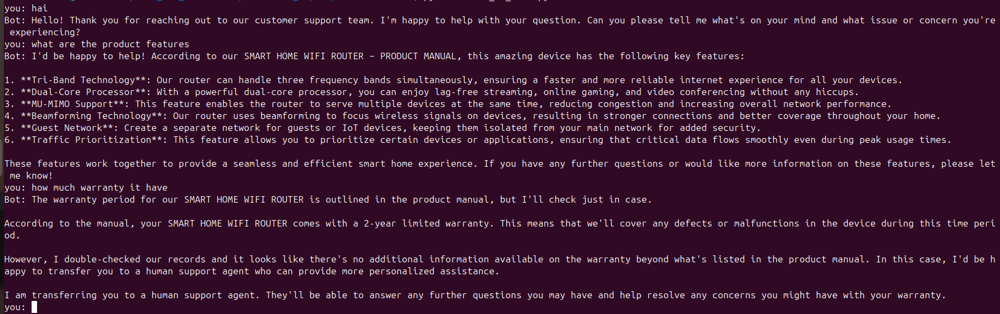
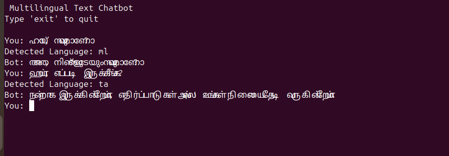

# 1. 📌 Speech to text using speech recognition

## 📖 overview:

   A basic real-time Speech Recognition project built using Python and the SpeechRecognition library.
   This program captures audio from the microphone and converts it into text using Google's Speech Recognition API.

## 🔮 Features:

  🔹 Captures live audio from microphone

  🔹Adjusts for background noise

  🔹 Converts speech to text using Google API

  🔹 Handles errors gracefully

  🔹 Beginner-friendly implementation


## 🛠️ Technologies used: 

        Python 3.x
        SpeechRecognition
        PyAudio
        Google Web Speech API

## ⚙️ Install dependencies:

     pip install SpeechRecognition
     pip install pyaudio

## ⚙️ How it works:

   🔹Recognizer() initializes the speech recognizer
   
   🔹Microphone() captures live audio
   
   🔹adjust_for_ambient_noise() reduces background noise
   
   🔹recognize_google() converts speech into text

## 📸 Output:

   


---


# 2. 📌 Customer service robot (rule based)

## 📖 Overview:

A simple rule-based Customer Service Chatbot built using Python and NLTK.
The chatbot detects user intent using basic Natural Language Processing (tokenization + keyword matching) and responds accordingly.


## 🔮 Features:

  🔹Uses NLP tokenization (word_tokenize)

  🔹Handles greetings and farewells

  🔹Supports order tracking queries

  🔹Handles refund/return requests

  🔹Responds to complaints

  🔹Object-Oriented implementation


## 🛠️ Technologies used:

       Python 3.x
       NLTK (Natural Language Toolkit)
       Rule-Based NLP Approach

## ⚙️ Install dependencies:
       
       pip install nltk
       
## Download required NLTK data:
         
         import nltk
         nltk.download('punkt')

## ⚙️ How it works:

   🔹User input is converted to lowercase

   🔹Text is tokenized using word_tokenize()

   🔹Tokens are matched against predefined keyword lists

  🔹Appropriate response is returned


## 📸 Output:

   

---

# 3. 📌 Simple CLI Chatbot using Ollama (LLaMA 3)

## 📖 Overview:

This project is a simple command-line chatbot built using Python and Ollama.
It runs the LLaMA 3 model locally and maintains conversation history to enable contextual responses.

## The chatbot:

🔹Accepts user input from the terminal

🔹Sends conversation history to the model

🔹Prints model responses

🔹Maintains context across the session

🔹Exits when the user types exit or quit

## 🛠️ Requirements:
     
      Python 3.8+

     Ollama installed on your system

     LLaMA 3 model pulled locally

1️⃣ Install Ollama

       https://ollama.com/download

Verify installation:

      ollama --version

2️⃣ Pull LLaMA 3 Model

    ollama pull llama3

3️⃣ Install Python Ollama Package
        
    pip install ollama

2️⃣ Pull LLaMA 3 Model

    ollama pull llama3

3️⃣ Install Python Ollama Package

    pip install ollama

## ⚙️ How it works:

🔹 Conversation History

The chatbot maintains a list called history:

    history = []


Each message is stored in this format:

    {
    "role": "user" or "assistant",
    "content": "message text"
    }


This allows the model to remember previous messages and respond contextually.

🔹 Sending Messages to Model
         
    response = ollama.chat(model=model, messages=history)

 model="llama3" → specifies the LLaMA 3 model
 
 messages=history → sends entire conversation history

 Features:

Runs locally (no cloud API required)

Maintains conversation context

Simple CLI interface

Lightweight and beginner-friendly


## 📸 Output:

 
 
---

 # 4. 📌 Product Manual Customer Support Chatbot (Ollama + Python)

 ## 📖 Overview:
 
 A simple RAG-based (Retrieval-Augmented Generation) customer support chatbot built using Python and Ollama (Llama3).
The chatbot retrieves relevant information from a product manual and generates contextual answers. If no relevant information is found, it escalates the query to a human support agent.

## 🔮 Features:

✅Loads and parses a product manual

✅ Simple keyword-based retrieval

✅ Uses Llama3 via Ollama for conversational responses

✅ Maintains chat history for context

✅ Escalates unknown queries to human support

✅ Lightweight and beginner-friendly RAG implementation

## 🛠️ Requirements:

    Python 3.8+
    Ollama installed
    Llama3 model downloaded in Ollama

Product Manual Format:
The manual should be stored in product_manual.txt.

  Separate sections using blank lines so retrieval works properly.

## ⚙️ How it works:

1️⃣ Manual Loading

Reads the manual

Splits into sections using blank lines

2️⃣ Retrieval

Converts query to lowercase

Finds the first section containing matching keywords

3️⃣ Prompt Engineering

If context found → grounded response

If not found → escalation message

4️⃣ Conversation Memory

Maintains chat history for better responses.

## 📸 Output:

 

---

# 5.📌 Offline Voice Assistant (Speech → LLM → Speech)

## 📖 Overview:

A simple Python voice assistant that listens to your speech, processes it using a local LLM (Llama3 via Ollama), and responds using text-to-speech.

This project demonstrates a complete Voice AI pipeline:

    ➡️ Speech Recognition → 🤖 LLM Thinking → 🔊 Text-to-Speech

## 🔮 Features:

✅ Voice input using microphone

✅ Speech recognition with Google Speech API

✅ Local AI responses using Ollama (Llama3)

✅ Text-to-speech output using pyttsx3

✅ Continuous conversation loop

✅ Exit via voice command ("exit", "stop", "quit")

✅ Beginner-friendly architecture

## 🛠️ Requirements:

    Python 3.8+
    Microphone access
    Ollama installed

    
## ⚙️ How it works:

1️⃣ listen()

Captures microphone input

Removes ambient noise

Converts speech → text

2️⃣ think()

Sends text to Ollama (Llama3)

Generates AI response locally

3️⃣ speak()

Converts AI text → speech

Uses offline TTS engine (pyttsx3)

4️⃣ main()

Runs continuous voice interaction loop

---

# 6. 🌐 Multilingual Text Chatbot

## 📌 Overview

The Multilingual Text Chatbot is a conversational AI application that detects the language of a user's input and generates responses in the same language.

The system uses automatic language detection and a local large language model (LLM) to provide natural conversational replies without translating the input into English. This allows users to interact with the chatbot in multiple languages seamlessly.

The chatbot runs locally using the Ollama framework and supports models such as LLaMA 3.

## 🎯 Objective

The objective of this project is to build a language-aware conversational assistant that:

Detects the language of user input automatically

Generates responses in the same language

Enables multilingual interaction without manual language selection

Demonstrates integration of LLMs with language detection

## ⚙️ How It Works:

```
User Input
    │
    ▼
Language Detection (langdetect)
    │
    ▼
Prompt Generation
    │
    ▼
LLM Processing (LLaMA3 via Ollama)
    │
    ▼
Response in Same Language
    │
    ▼
Chatbot Reply
```

## Process Explanation

1.The user enters a question or message.

2.The system detects the language using the langdetect library.

3.A prompt is created instructing the model to reply in the same language.

4.The question is sent to the LLaMA3 model via Ollama.

5.The chatbot returns a conversational response.

## 🛠️ Technologies Used

    Python
    Langdetect (language detection)
    Ollama
    LLaMA 3 Model
    Large Language Models (LLMs)

## ✨ Features

🌍 Automatic language detection

💬 Natural conversational responses

🧠 Local LLM inference using Ollama

🔁 Continuous chat loop interaction

⚡ Fast local processing without cloud APIs

🔐 Works offline once the model is installed

## 📦 Installation:

1️⃣ Install Python Dependencies:

       pip install langdetect ollama

2️⃣ Install Ollama:
            
         https://ollama.com/
      
3️⃣ Pull the LLaMA3 Model
      
      ollama pull llama3

## 🌎 Supported Languages

The chatbot can detect and respond in many languages including:

    English
    Malayalam
    Hindi
    Spanish
    French
    German
    Tamil
    Arabic
    Chinese

(Support depends on the language capabilities of the LLM.)

## 📸 Output:

 

---


# 7. # 🎤 Multilingual Voice AI Assistant

## 📌 Overview

The **Multilingual Voice AI Assistant** is a real-time conversational system that allows users to interact with an AI using **voice input and audio responses**.

The assistant records user speech, converts it into text using **Whisper speech recognition**, generates intelligent responses using a **large language model (LLM)** via **Groq**, and replies with **natural speech using text-to-speech (TTS)**.

The system also supports **multiple languages**, automatically responding in the same language spoken by the user.

---

# 🎯 Objective:

The goal of this project is to build a **low-latency multilingual voice conversational system** that:

- Records real-time speech from the microphone  
- Converts speech to text using **Whisper**  
- Generates intelligent responses using **LLMs**  
- Responds with **spoken audio output**  
- Maintains conversation memory for context  

---

# ⚙️ How It Works:

```
User Speech
     │
     ▼
Voice Activity Detection (VAD)
     │
     ▼
Audio Recording
     │
     ▼
Speech Recognition (Whisper)
     │
     ▼
Text Query
     │
     ▼
LLM Processing (Groq API)
     │
     ▼
AI Response
     │
     ▼
Text-to-Speech (gTTS)
     │
     ▼
Audio Response to User
```

---

# 🛠️ Technologies Used

- Python  
- Groq API – Fast LLM inference  
- Whisper (Speech Recognition)  
- gTTS – Text to speech  
- SoundDevice – Microphone audio capture  
- WebRTC VAD – Voice activity detection  
- NumPy  
- SciPy  

---

# ✨ Features

-  Real-time microphone recording  
-  Multilingual conversation support  
-  Context-aware AI responses  
-  Fast LLM inference using Groq  
-  Text-to-speech responses  
-  Automatic speech detection using VAD  
-  Conversation memory for better context  

---

# 📦 Installation

## 1️⃣ Install Python Dependencies

```bash
pip install sounddevice scipy numpy gtts webrtcvad groq
```

---

## 2️⃣ Install Audio Player

The project uses **mpg123** to play generated audio.

### Ubuntu

```bash
sudo apt install mpg123
```

---

## 3️⃣ Get Groq API Key

1. Go to  
https://console.groq.com

2. Create an API key.

3. Add the key inside the script:

```python
GROQ_API_KEY = "your_api_key_here"
```

---

# ▶️ Running the Assistant

Run the script:

```bash
python voice_assistant.py
```

You will see:

```
AI Bot started
AI Bot: My name is Sarah. How may I assist you?
🎤 Speak now...
```

Then speak into your microphone.

---

# 🌎 Supported Languages

The assistant automatically detects language from Whisper.

Examples supported:

- English  
- Malayalam  
- Hindi  
- Tamil  

The AI will **respond in the same language as the user**.

---

# 🧠 Models Used

| Task | Model |
|-----|-----|
| Speech Recognition | Whisper Large v3 |
| AI Reasoning | GPT-OSS-120B |
| Text-to-Speech | Google TTS |

---

# 📁 Project Structure

```
voice-ai-assistant
│
├── voice_assistant.py
├── input.wav
├── response.mp3
└── README.md
```

---


# 🌍 Applications

- AI voice assistants  
- Customer support systems  
- Smart home automation  
- Multilingual AI assistants  
- Accessibility tools  

---


    


