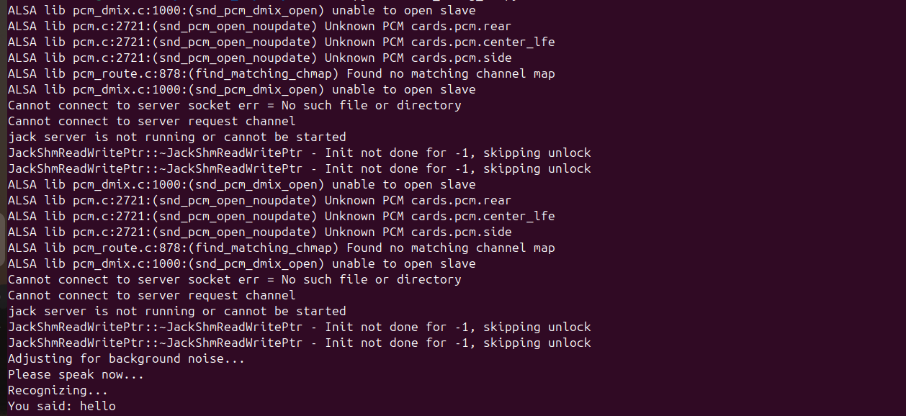
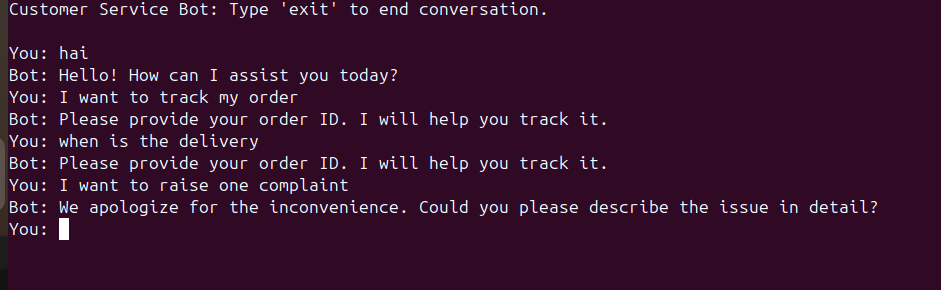
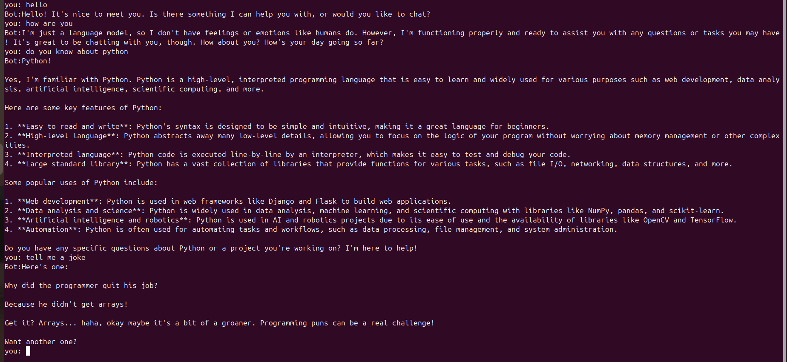

# 1. Speech to text using speech recognition

   A basic real-time Speech Recognition project built using Python and the SpeechRecognition library.
   This program captures audio from the microphone and converts it into text using Google's Speech Recognition API.

Features:
---
   Captures live audio from microphone

   Adjusts for background noise

  Converts speech to text using Google API

  Handles errors gracefully

  Beginner-friendly implementation

Technologies used: 
---
        Python 3.x
        SpeechRecognition
        PyAudio
        Google Web Speech API

Install dependencies:
---
     pip install SpeechRecognition
     pip install pyaudio

How it works:
---
   Recognizer() initializes the speech recognizer
   
   Microphone() captures live audio
   
   adjust_for_ambient_noise() reduces background noise
   
   recognize_google() converts speech into text

Output:
---
   

# 2.Customer service robot (rule based)

A simple rule-based Customer Service Chatbot built using Python and NLTK.
The chatbot detects user intent using basic Natural Language Processing (tokenization + keyword matching) and responds accordingly.

Features:
---
  Uses NLP tokenization (word_tokenize)

  Handles greetings and farewells

  Supports order tracking queries

  Handles refund/return requests

  Responds to complaints

  Object-Oriented implementation

Technologies used:
---
       Python 3.x
       NLTK (Natural Language Toolkit)
       Rule-Based NLP Approach

Install dependencies:
 ---      
       pip install nltk
       
Download required NLTK data:
 ---        
         import nltk
         nltk.download('punkt')

How it works:
---
   User input is converted to lowercase

   Text is tokenized using word_tokenize()

   Tokens are matched against predefined keyword lists

  Appropriate response is returned

Output:
---
   

# 3.Simple CLI Chatbot using Ollama (LLaMA 3)

This project is a simple command-line chatbot built using Python and Ollama.
It runs the LLaMA 3 model locally and maintains conversation history to enable contextual responses.

The chatbot:
---
Accepts user input from the terminal

Sends conversation history to the model

Prints model responses

Maintains context across the session

Exits when the user types exit or quit

Requirements:
 ---    
       Python 3.8+

     Ollama installed on your system

     LLaMA 3 model pulled locally

1️⃣ Install Ollama

       https://ollama.com/download

Verify installation:

      ollama --version

2️⃣ Pull LLaMA 3 Model

    ollama pull llama3

3️⃣ Install Python Ollama Package
        
    pip install ollama

2️⃣ Pull LLaMA 3 Model

    ollama pull llama3

3️⃣ Install Python Ollama Package

    pip install ollama

How it works:
---
🔹 Conversation History

The chatbot maintains a list called history:

    history = []

Each message is stored in this format:

    {
    "role": "user" or "assistant",
    "content": "message text"
    }

This allows the model to remember previous messages and respond contextually.

🔹 Sending Messages to Model
         
    response = ollama.chat(model=model, messages=history)

 model="llama3" → specifies the LLaMA 3 model
 
 messages=history → sends entire conversation history

 Features:

Runs locally (no cloud API required)

Maintains conversation context

Simple CLI interface

Lightweight and beginner-friendly

 Output:
---
 

 # 4. Product Manual Customer Support Chatbot (Ollama + Python)
 
 A simple RAG-based (Retrieval-Augmented Generation) customer support chatbot built using Python and Ollama (Llama3).
The chatbot retrieves relevant information from a product manual and generates contextual answers. If no relevant information is found, it escalates the query to a human support agent.

## Features:

✅Loads and parses a product manual

✅ Simple keyword-based retrieval

✅ Uses Llama3 via Ollama for conversational responses

✅ Maintains chat history for context

✅ Escalates unknown queries to human support

✅ Lightweight and beginner-friendly RAG implementation

## Requirements:

    Python 3.8+
    Ollama installed
    Llama3 model downloaded in Ollama

Product Manual Format:
The manual should be stored in product_manual.txt.

  Separate sections using blank lines so retrieval works properly.

## How it works:

1️⃣ Manual Loading

Reads the manual

Splits into sections using blank lines

2️⃣ Retrieval

Converts query to lowercase

Finds the first section containing matching keywords

3️⃣ Prompt Engineering

If context found → grounded response

If not found → escalation message

4️⃣ Conversation Memory

Maintains chat history for better responses

